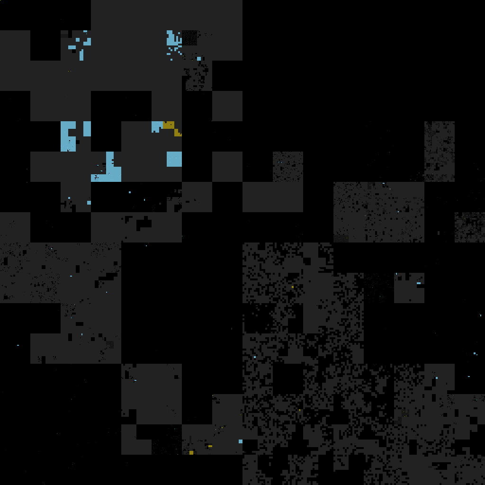
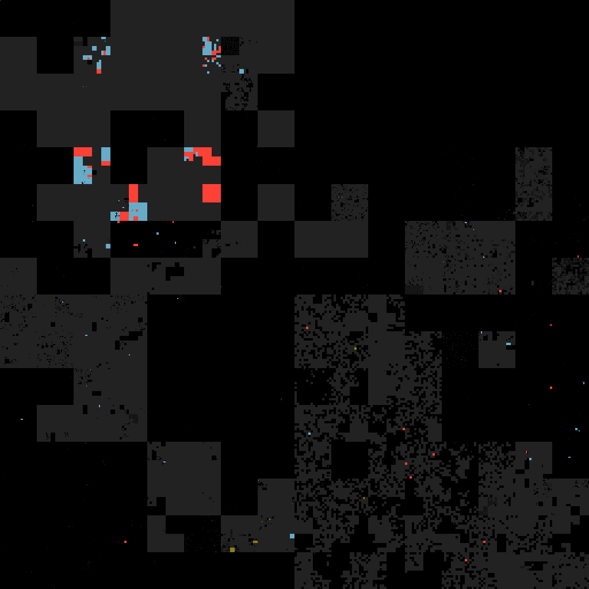

# Визуализация заблокированных адресов сети

Генерирует полную карту IPv4, закрашивая указанные сегменты выбранным цветом

Заполнение сегментов производится с помощью [фрактала Гилберта](https://github.com/ailove-lab/Ailove-Hilbert)

## C версия

[hilbert](hilbert/)

## Web версия

[Демо](https://ailove-lab.github.io/cidr/)

Список подсетей можно редактировать, отрисовка по `ctrl+enter`

### Пример

 - Серый - us
 - Голубой - amazon
 - Желтый - google
 - Красный - заблокировано РКН

