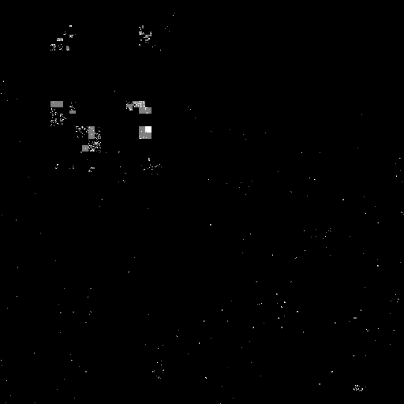

# Визуализация заблокированных адресов сети

Генерирует полную карту IPv4, закрашивая указанные сегменты выбранным цветом

Заполнение сегментов производится с помощью [фрактала Гилберта](https://github.com/ailove-lab/Ailove-Hilbert)

## C версия

[hilbert](hilbert/) - запускается каждые 4 часа, генерирует чб карту блокировок [rkn-map](rkn-map/)

## Web версия

[Демо](https://ailove-lab.github.io/cidr/)

Список подсетей можно редактировать, отрисовка по `ctrl+enter`

### Пример

 - Серый - us
 - Голубой - amazon
 - Желтый - google
 - Красный - заблокировано РКН

## TODO

- [ ] Добавить выбор цвета в C версию
- [ ] Поправить математику блендинга пересекающихся сегментов
- [ ] Собрать историческую анимацию
- [ ] Добавить в веб версию закешированные слои и возможность их включать/выключать
