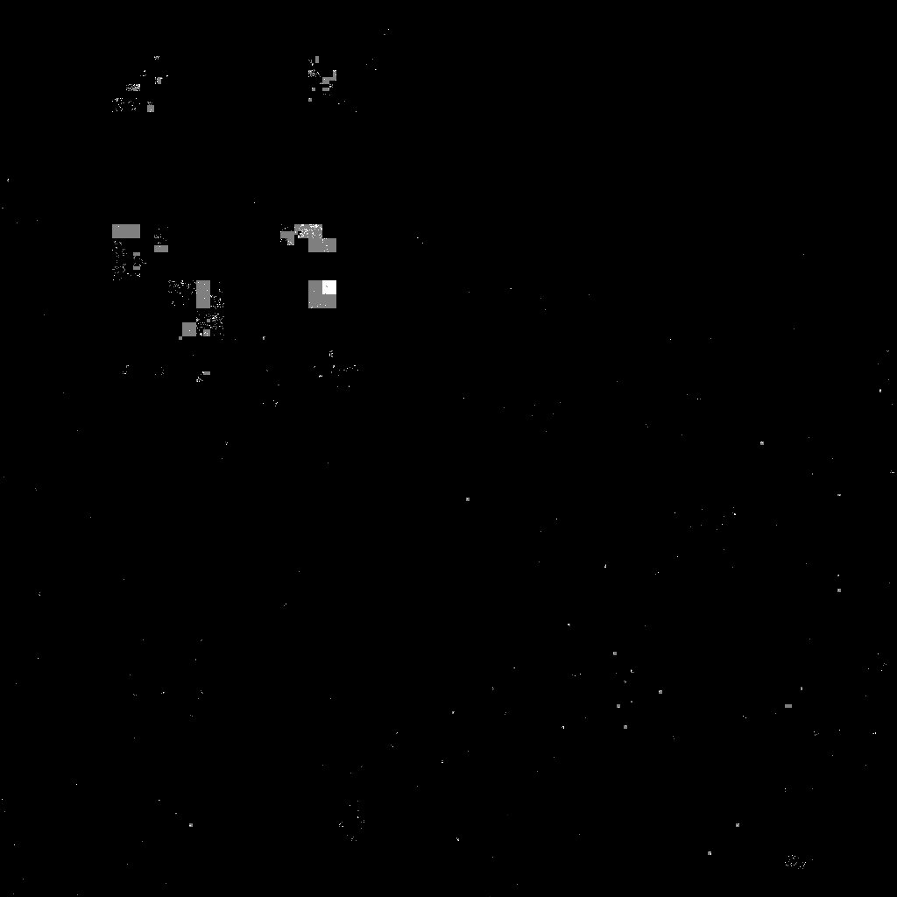

# Версия визуализации на C

Сборка: `./build.sh`

Запуск: `./hilbert file.cidr [2] [in.png] [out.png]`

 - file.cidr - файл с диапазонами
 - 2 - разрешение, 0 - 256х256, 1-512х512, 2-1024х1024, ...
 - in.png - входнoе изображение, к которому будет прибавлен результат
 - out.png - название результирующего png

